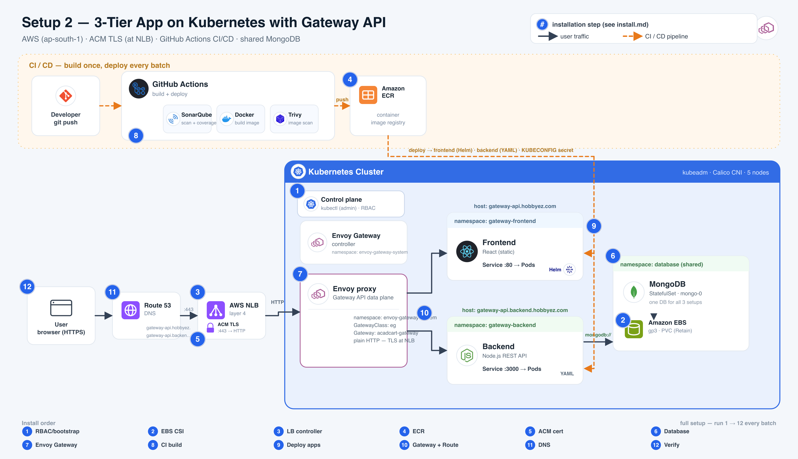

# Setup 2 — Gateway API (Envoy) · Install Flow

3-tier app (**React** frontend → **Node.js** backend → **MongoDB**) on a kubeadm cluster. One AWS
**NLB** terminates TLS with an **ACM** cert and forwards plain HTTP to **Envoy Gateway**, which
routes by hostname (Gateway API `HTTPRoute`) to the two apps. CI/CD is **GitHub Actions**, and all
three demo setups share one **MongoDB**.



> The numbered badges in the diagram match the step numbers below.
> **One command:** `./gateway-api/install.sh` runs steps 1 → 12 for you (all but step 8, the CI build).
> The ACM cert is auto-resolved (pin one with `ACM_ARN=<arn> ./gateway-api/install.sh`). Or follow the
> manual steps below — same flow, step by step.
> The pre-setup and database commands are idempotent, so they no-op if already present.
> Run everything from the `cicd_k8s/` directory.

## Prerequisites

```bash
export AWS_ACCESS_KEY_ID=...          # IAM user with EBS + ELB + ECR + ACM + Route53 access
export AWS_SECRET_ACCESS_KEY=...
export AWS_REGION=ap-south-1
```

A reachable kubeadm cluster and `kubectl`/`helm` on your laptop.

---

## Install (steps 1–12)

Steps 1–4 and 6 are the same across all setups (shared cluster infra + database); step 5 uses
**ACM**, not cert-manager. All are idempotent, so re-running them each batch is safe.

### 1 · RBAC + bootstrap
```bash
kubectl apply -f pre-setup/rbac-admin.yaml
kubectl -n kube-system get secret local-admin-token -o jsonpath='{.data.token}' | base64 -d; echo
./pre-setup/00-rbac-kubeconfig.sh     # paste the token + https://<master-public-ip>:6443
```

### 2 · EBS CSI driver
```bash
./pre-setup/01-ebs-csi-driver.sh
kubectl apply -f pre-setup/storageclass.yaml       # ebs-sc — gp3, Retain
```

### 3 · AWS Load Balancer Controller
```bash
./pre-setup/02-aws-load-balancer-controller.sh     # type: LoadBalancer -> real NLB
```

### 4 · ECR repositories
```bash
./pre-setup/05-ecr-setup.sh                           # repos: frontend_react, backend_node
```

### 5 · ACM certificate  (TLS terminates at the NLB)
One wildcard cert covers both hostnames; Setups 2 & 3 share it. **`install.sh` resolves this
automatically** — reuses the ISSUED cert, or creates + DNS-validates one. To do it by hand (or pre-warm
it before the demo), run the idempotent helper — it creates the Route53 validation records, waits for
ISSUED, and prints the ARN:
```bash
./pre-setup/06-acm-cert.sh
export ACM_ARN=<the arn it prints>
```

### 6 · Shared database (MongoDB)
```bash
./database/apply.sh                                 # idempotent; kept across every batch reset
```

### 7 · Install Envoy Gateway
```bash
ACM_ARN="$ACM_ARN" ./gateway-api/install-controller.sh   # Gateway API CRDs + Envoy Gateway + GatewayClass eg
```
The `EnvoyProxy` carries the ACM annotations, so the NLB it provisions terminates TLS.

### 8 · Build & push images  (GitHub Actions CI)
Push to the app repos (or run the workflow). Each pipeline: **SonarQube** → **Docker** build →
**Trivy** → push to **ECR**. Repo secrets needed: `AWS_ACCESS_KEY_ID`, `AWS_SECRET_ACCESS_KEY`,
`KUBECONFIG_B64` (base64 of `pre-setup/kubeconfig-deployer.yaml`), `DEPLOY_REPO_PAT`.

### 9 · Deploy the apps
GitHub Actions deploys with the deployer kubeconfig — **frontend as Helm, backend as YAML**.

<details><summary>Manual fallback</summary>

```bash
helm upgrade --install frontend gateway-api/frontend \
  -n gateway-frontend --create-namespace            # frontend (Helm chart)
kubectl apply -f gateway-api/backend/               # namespace: gateway-backend (raw YAML)
```
</details>

### 10 · Apply the routing  (this provisions the NLB)
```bash
kubectl apply -f gateway-api/gateway.yaml -f gateway-api/httproute.yaml
kubectl get gateway,httproute -A                    # PROGRAMMED / Accepted = True
```
Envoy Gateway provisions the NLB only when the `Gateway` exists — so DNS comes next, not before.

### 11 · Point DNS at the NLB
```bash
NLB=$(kubectl -n envoy-gateway-system get svc -l gateway.envoyproxy.io/owning-gateway-name=acadcart-gateway \
      -o jsonpath='{.items[0].status.loadBalancer.ingress[0].hostname}')
ZONE=Z07010022C4LQ7Z9ZKUKL

for host in gateway-api.hobbyez.com gateway-api.backend.hobbyez.com; do
  aws route53 change-resource-record-sets --hosted-zone-id $ZONE --change-batch '{
    "Changes":[{"Action":"UPSERT","ResourceRecordSet":{
      "Name":"'"$host"'","Type":"CNAME","TTL":60,
      "ResourceRecords":[{"Value":"'"$NLB"'"}]}}]}'
done
```

### 12 · Verify
```bash
curl -I https://gateway-api.hobbyez.com                     # 200, ACM cert
curl -s https://gateway-api.backend.hobbyez.com/healthz     # {"status":"ok","dbStatus":"connected"}
```

---

## Between batches — reset
```bash
./gateway-api/uninstall.sh            # add DELETE_DNS=1 (with AWS creds) to also drop the DNS records
```
Removes the apps, HTTPRoutes, Gateway, NLB, and Envoy Gateway controller. **Keeps** the database,
`pre-setup`, and the Gateway API CRDs. Then re-run the full setup for the next batch.

## URLs
| | |
| --- | --- |
| Frontend | https://gateway-api.hobbyez.com |
| Backend  | https://gateway-api.backend.hobbyez.com/healthz |
