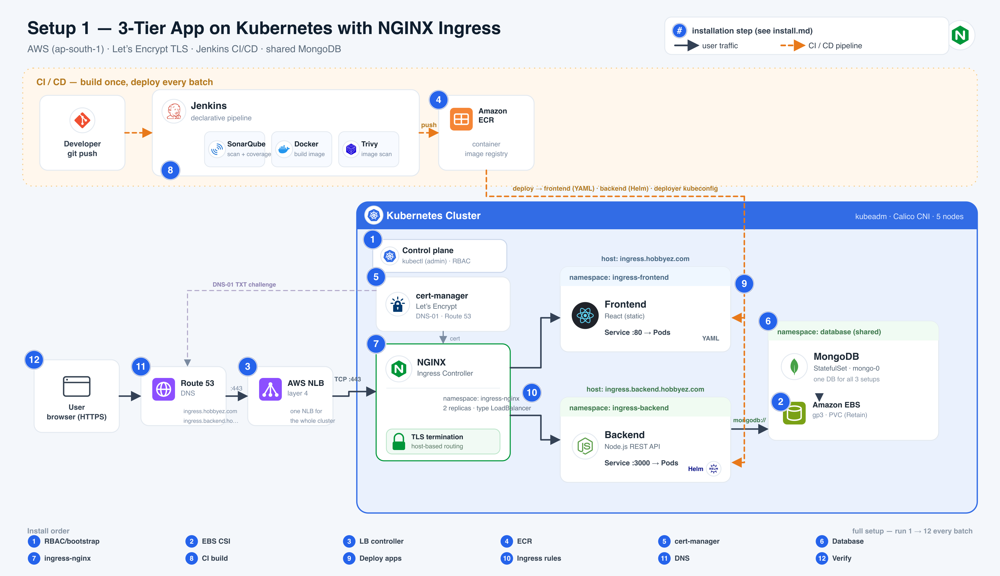

# Setup 1 — NGINX Ingress · Install Flow

3-tier app (**React** frontend → **Node.js** backend → **MongoDB**) on a kubeadm cluster. One AWS **NLB**
fronts the **NGINX Ingress** controller, which routes by hostname to the two apps. TLS is issued
by **Let's Encrypt** (cert-manager, DNS-01), CI/CD is **Jenkins**, and all three demo setups share
one **MongoDB**.



> The numbered badges in the diagram match the step numbers below.
> **One command:** `./ingress-nginx/install.sh` runs steps 1 → 12 for you (all but step 8, the CI
> build). Or follow the manual steps below — same flow, step by step.
> The pre-setup and database commands are idempotent, so they no-op if already present.
> Run everything from the `cicd_k8s/` directory.

## Prerequisites

```bash
export AWS_ACCESS_KEY_ID=...          # IAM user with EBS + ELB + ECR + Route53 access
export AWS_SECRET_ACCESS_KEY=...
export AWS_REGION=ap-south-1
```

A reachable kubeadm cluster and `kubectl`/`helm` on your laptop.

---

## Install (steps 1–12)

Steps 1–6 set up shared cluster infra + the database (all idempotent, safe to re-run each batch).

### 1 · RBAC + bootstrap
```bash
# on the cluster (needs an existing admin) — create the local-admin identity, print its token
kubectl apply -f pre-setup/rbac-admin.yaml
kubectl -n kube-system get secret local-admin-token -o jsonpath='{.data.token}' | base64 -d; echo

# on your laptop — paste that token + https://<master-public-ip>:6443
./pre-setup/00-rbac-kubeconfig.sh
```
Sets `local-admin@k8s-3tier` as your current context, writes `pre-setup/kubeconfig-deployer.yaml`
(the CI credential), and creates `aws-secret` in `kube-system`.

### 2 · EBS CSI driver
```bash
./pre-setup/01-ebs-csi-driver.sh
kubectl apply -f pre-setup/storageclass.yaml       # ebs-sc — gp3, Retain
```

### 3 · AWS Load Balancer Controller
```bash
./pre-setup/02-aws-load-balancer-controller.sh     # also patches node providerID
```
Turns `type: LoadBalancer` Services into real NLBs. Without it, step 7 stays `<pending>`.

### 4 · ECR repositories
```bash
./pre-setup/05-ecr-setup.sh                           # creates repos: frontend_react, backend_node
```

### 5 · cert-manager + Let's Encrypt issuer
cert-manager is a cluster platform (like the LB controller / ArgoCD), so it lives in `pre-setup`.
Setups 2 & 3 use ACM at the NLB and skip it.
```bash
./pre-setup/03-install-cert-manager.sh                # cert-manager platform + route53-creds (uses AWS keys)
kubectl apply -f cert-manager/clusterissuer.yaml   # ClusterIssuer: letsencrypt-prod
```

### 6 · Shared database (MongoDB)
```bash
./database/apply.sh                                 # idempotent; kept across every batch reset
```

### 7 · Install the NGINX ingress controller
```bash
./ingress-nginx/install-controller.sh
```
Prints the **NLB DNS name** at the end — copy it for step 11.

### 8 · Build & push images  (Jenkins CI)
Trigger the Jenkins job in each app repo (or just `git push`). The pipeline runs:
**SonarQube** (scan + coverage) → **Docker** build → **Trivy** scan → push to **ECR**.

<details><summary>Manual fallback (no Jenkins)</summary>

```bash
ECR=637423622313.dkr.ecr.$AWS_REGION.amazonaws.com
aws ecr get-login-password --region $AWS_REGION | docker login --username AWS --password-stdin $ECR
# in frontend_react/ and backend_node/ respectively:
docker build -t $ECR/frontend_react:1 . && docker push $ECR/frontend_react:1
docker build -t $ECR/backend_node:1   . && docker push $ECR/backend_node:1
```
</details>

### 9 · Deploy the apps
Jenkins deploys with `pre-setup/kubeconfig-deployer.yaml` — **frontend as YAML, backend as Helm**.

<details><summary>Manual fallback</summary>

```bash
kubectl apply -f ingress-nginx/frontend/            # namespace: ingress-frontend (raw YAML)
helm upgrade --install backend ingress-nginx/backend \
  -n ingress-backend --create-namespace             # backend (Helm chart)
```
The frontend pulls its private ECR image via the `ecr-creds` pull secret (CI seeds it).
</details>

### 10 · Apply the ingress routing (+ TLS)
```bash
kubectl apply -f ingress-nginx/ingress.yaml
kubectl get certificate -A -w        # frontend-tls, backend-tls → READY=True (Let's Encrypt)
```

### 11 · Point DNS at the NLB
```bash
NLB=$(kubectl -n ingress-nginx get svc ingress-nginx-controller \
      -o jsonpath='{.status.loadBalancer.ingress[0].hostname}')
ZONE=Z07010022C4LQ7Z9ZKUKL

for host in ingress.hobbyez.com ingress.backend.hobbyez.com; do
  aws route53 change-resource-record-sets --hosted-zone-id $ZONE --change-batch '{
    "Changes":[{"Action":"UPSERT","ResourceRecordSet":{
      "Name":"'"$host"'","Type":"CNAME","TTL":60,
      "ResourceRecords":[{"Value":"'"$NLB"'"}]}}]}'
done
```

### 12 · Verify
```bash
kubectl get ingress -A               # ADDRESS shows the NLB
curl -I https://ingress.hobbyez.com                       # 200, valid cert
curl -s https://ingress.backend.hobbyez.com/healthz       # {"status":"ok","dbStatus":"connected"}
```

---

## Reset
```bash
./ingress-nginx/uninstall.sh          # add DELETE_DNS=1 (with AWS creds) to also drop the DNS records
```
Removes the apps, ingresses, controller, and NLB. **Keeps** the database, cert-manager, and
`pre-setup` (cluster infra). Then re-run the full setup for the next batch.

## URLs
| | |
| --- | --- |
| Frontend | https://ingress.hobbyez.com |
| Backend  | https://ingress.backend.hobbyez.com/healthz |
