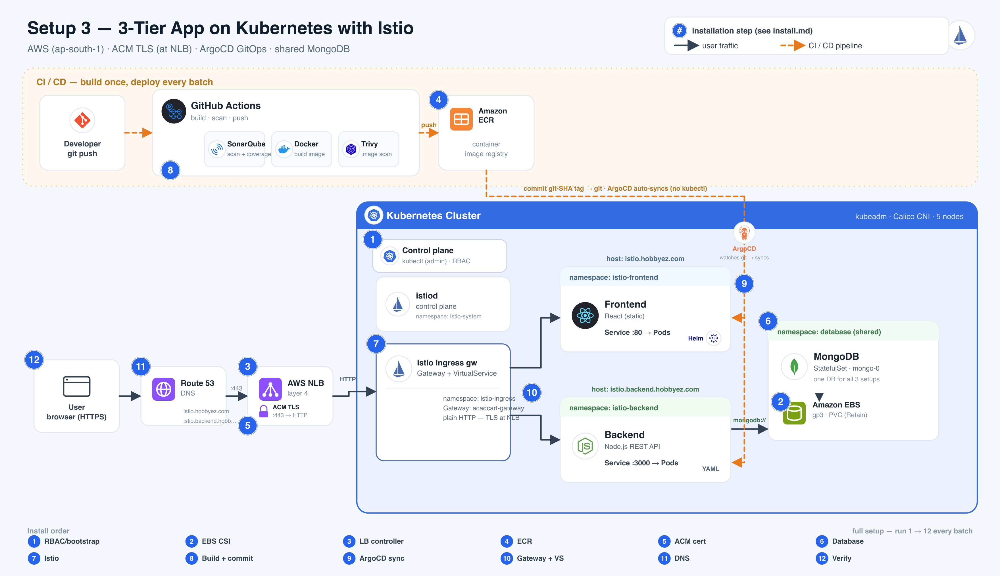

# Setup 3 — Istio · Install Flow

3-tier app (**React** frontend → **Node.js** backend → **MongoDB**) on a kubeadm cluster. One AWS
**NLB** terminates TLS with an **ACM** cert and forwards plain HTTP to the **Istio ingress gateway**,
which routes by hostname (`Gateway` + `VirtualService`) to the two apps. Deployment is **ArgoCD**
(GitOps), and all three demo setups share one **MongoDB**.



> The numbered badges in the diagram match the step numbers below.
> **One command:** `./istio/install.sh` runs steps 1 → 12 for you (all but step 8, the CI build; it
> deploys the apps directly — ArgoCD is the step-9 alternative). The ACM cert is auto-resolved (pin one
> with `ACM_ARN=<arn> ./istio/install.sh`). Or follow the manual steps below.
> The pre-setup and database commands are idempotent, so they no-op if already present.
> Run everything from the `cicd_k8s/` directory.

## Prerequisites

```bash
export AWS_ACCESS_KEY_ID=...          # IAM user with EBS + ELB + ECR + ACM + Route53 access
export AWS_SECRET_ACCESS_KEY=...
export AWS_REGION=ap-south-1
```

A reachable kubeadm cluster and `kubectl`/`helm` on your laptop.

---

## Install (steps 1–12)

Steps 1–4 and 6 are the same across all setups (shared cluster infra + database); step 5 uses
**ACM** (the same wildcard cert as Setup 2). All are idempotent, so re-running them each batch is safe.

### 1 · RBAC + bootstrap
```bash
kubectl apply -f pre-setup/rbac-admin.yaml
kubectl -n kube-system get secret local-admin-token -o jsonpath='{.data.token}' | base64 -d; echo
./pre-setup/00-rbac-kubeconfig.sh     # paste the token + https://<master-public-ip>:6443
```

### 2 · EBS CSI driver
```bash
./pre-setup/01-ebs-csi-driver.sh
kubectl apply -f pre-setup/storageclass.yaml       # ebs-sc — gp3, Retain
```

### 3 · AWS Load Balancer Controller
```bash
./pre-setup/02-aws-load-balancer-controller.sh     # type: LoadBalancer -> real NLB
```

### 4 · ECR repositories
```bash
./pre-setup/05-ecr-setup.sh                           # repos: frontend_react, backend_node
```

### 5 · ACM certificate  (TLS terminates at the NLB)
The same wildcard cert as Setup 2 (`*.hobbyez.com` + `*.backend.hobbyez.com`). **`install.sh` resolves
this automatically** — reuses the ISSUED cert, or creates + DNS-validates one. To do it by hand (or
pre-warm it before the demo), run the idempotent helper and export the ARN it prints:
```bash
./pre-setup/06-acm-cert.sh
export ACM_ARN=<the arn it prints>
```

### 6 · Shared database (MongoDB)
```bash
./database/apply.sh                                 # idempotent; kept across every batch reset
```

### 7 · Install Istio
```bash
ACM_ARN="$ACM_ARN" ./istio/install-controller.sh   # base + istiod + ingress gateway (NLB w/ ACM)
```

### 8 · Build, push & commit the tag  (GitHub Actions — GitOps CI)
The app repos have a GitOps workflow **`deploy-istio.yml`** (`setup3-istio-frontend` / `-backend`).
Trigger it (Actions → *Run workflow*). It runs **SonarQube** → **Docker** build → **Trivy** → pushes to
**ECR** with an **immutable git-SHA tag** (`sha-<7>`), then **commits that tag into this repo**
(`istio/argocd/applications.yaml` for the frontend, `istio/backend/02-deployment.yaml` for the backend).
> This is the GitOps handoff — **CI never runs `kubectl`**; it just commits the tag and ArgoCD deploys.
> Needs a `DEPLOY_REPO_PAT` with **write** on `cicd_k8s`.

### 9 · ArgoCD deploys the committed tag  (auto-sync)
Install ArgoCD once and register the two Applications; from then on **every tag-commit from step 8
auto-syncs** — frontend as Helm, backend as YAML. This is pull-based CD: ArgoCD reconciles the cluster
to whatever tag is in git.
> ArgoCD reads the **pushed branch**, not local files — `git push cicd_k8s` first.
```bash
[GITHUB_USER=.. GITHUB_PAT=..] ./pre-setup/04-install-argocd.sh   # ArgoCD platform (cluster infra, once)
kubectl apply -f istio/argocd/applications.yaml                # register istio-frontend + istio-backend
```
`04-install-argocd.sh` installs ArgoCD via Helm, **auto-exposes it at `https://argocd.hobbyez.com`**
(NLB + ACM — cert & DNS resolved automatically; falls back to port-forward if no AWS creds), registers
the repo (`GITHUB_*` only if private), and prints the URL + admin password.

<details><summary>Manual fallback (no ArgoCD — this is what <code>install.sh</code> does)</summary>

```bash
helm upgrade --install frontend istio/frontend -n istio-frontend --create-namespace
kubectl apply -f istio/backend/
```
</details>

### 10 · Apply the routing
```bash
kubectl apply -f istio/gateway.yaml -f istio/virtualservice.yaml
kubectl -n istio-ingress get gateway,virtualservice
```

### 11 · Point DNS at the NLB
```bash
NLB=$(kubectl -n istio-ingress get svc istio-ingressgateway \
      -o jsonpath='{.status.loadBalancer.ingress[0].hostname}')
ZONE=Z07010022C4LQ7Z9ZKUKL

for host in istio.hobbyez.com istio.backend.hobbyez.com; do
  aws route53 change-resource-record-sets --hosted-zone-id $ZONE --change-batch '{
    "Changes":[{"Action":"UPSERT","ResourceRecordSet":{
      "Name":"'"$host"'","Type":"CNAME","TTL":60,
      "ResourceRecords":[{"Value":"'"$NLB"'"}]}}]}'
done
```

### 12 · Verify
```bash
curl -I https://istio.hobbyez.com                       # 200, ACM cert
curl -s https://istio.backend.hobbyez.com/healthz       # {"status":"ok","dbStatus":"connected"}
# http:// also opens — the NLB :80 listener serves the same gateway (no redirect; NLB owns TLS)
```

---

## Between batches — reset
```bash
./istio/uninstall.sh                  # add DELETE_DNS=1 (with AWS creds) to also drop the DNS records
```
Deletes the ArgoCD Applications (so they stop re-syncing), the apps, Gateway/VirtualService, the
istio ingress gateway + istiod/base, and the NLB. **Keeps** the database and `pre-setup`. Then
re-run the full setup for the next batch.

## URLs
| | |
| --- | --- |
| Frontend | https://istio.hobbyez.com |
| Backend  | https://istio.backend.hobbyez.com/healthz |
