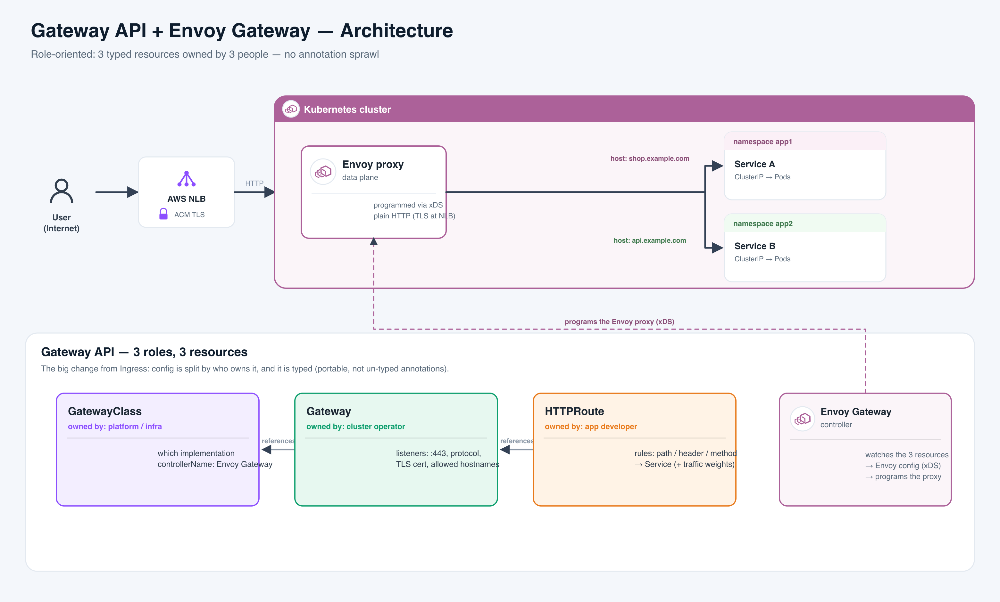

# Gateway API + Envoy Gateway

**In one line:** Gateway API is the modern, standard way to get outside traffic into a Kubernetes cluster — it replaces the old **Ingress** object, and **Envoy Gateway** is the software that actually makes it work.

**The analogy — an apartment building.** Think of getting a visitor to the right tenant:

- **GatewayClass** = *which construction firm you hired* to build and maintain the building. You don't lay bricks; you pick the builder. → picks the **implementation** (Envoy Gateway).
- **Gateway** = *the building itself* once it's up — which front doors are unlocked (**ports**), what street address it answers to (**hostname**), whether the door has a lock (**TLS**), and the guest policy for who may receive visitors.
- **HTTPRoute** = *a tenant's instruction card at the front desk*: "anyone asking for shop.example.com, send them to my unit."
- **Envoy** = *the doorman* physically greeting each visitor and walking them to the right unit.
- **Envoy Gateway** = *the building management office* that reads every instruction card and briefs the doorman — live, over his earpiece.

**Read the diagram (left → right)**
- **Far left:** a user on the internet hits your DNS name. The **AWS NLB** — *(plain English: Amazon's network load balancer, the cloud front door)* — terminates HTTPS with an **ACM** cert and forwards plain HTTP inward.
- **Middle:** the **Envoy proxy** (the doorman) receives that traffic and routes by hostname — `shop.example.com` → Service A, `api.example.com` → Service B — each landing on pods, even in different namespaces.
- **Bottom row:** the config that produced that behavior — three typed resources, each owned by a *different* team: **GatewayClass** (infra) → **Gateway** (platform) → **HTTPRoute** (app dev).
- **Bottom right:** the **Envoy Gateway controller** watches those three resources and continuously programs the Envoy proxy (the dashed line going up).
- **Takeaway:** top half = live traffic (**data plane**); bottom half = who wrote the rules (**control plane**).

---

## The one thing to get right: 3 resources, 3 owners

This is the part people find hardest. It's just a split of one old object into three, by *who owns each*.

| Resource | Analogy | Plain English | Who owns it |
|---|---|---|---|
| **GatewayClass** | the builder you hired | Names the **controller** — *(plain English: the software that turns YAML into a running gateway)* — that will run your gateways. Cluster-wide. | Infra team |
| **Gateway** | the building + which doors are open | Declares **listeners** — *(plain English: an open port + hostname + optional TLS)* — and `allowedRoutes` (which teams may attach). Creating it spins up real Envoy pods + a cloud load balancer. | Platform / cluster operator |
| **HTTPRoute** | tenant's "send my visitors to unit 5" card | The routing rules: match on path / header / method / host, then forward to a **Service** with optional traffic **weights**. | App developer |

**Envoy vs Envoy Gateway — don't mix these up:**
- **Envoy** is the **data plane** — *(plain English: the proxy actually moving requests)*. It's the doorman. Battle-tested; born at Lyft.
- **Envoy Gateway** is the **control plane** — *(plain English: the brain that configures the doorman)*. It watches your Gateway API resources and programs Envoy. It's the management office.
- The link between them is **xDS** — *(plain English: a live config feed Envoy listens to)*. New rules apply in **milliseconds with no restart** — like updating the doorman over his earpiece instead of sending him home to re-read a binder. (Old NGINX Ingress reloads the whole process on every change.)

**Why this beats Ingress's "annotation soup":** old Ingress crammed every feature into vendor-specific **annotations** — *(plain English: free-text sticky notes on the object, unchecked and non-portable)*. Gateway API makes them **typed fields** the cluster validates, and the *same YAML runs on Envoy, Istio, Cilium, NGINX, and cloud load balancers*. Anything exotic attaches as a small **policy CRD** — *(plain English: CRD = a custom object type the vendor added to Kubernetes)*.

---

## Where real companies use it

- **The Trade Desk** → migrated bare-metal HAProxy to Envoy Gateway + Gateway API, now serving **~20 million requests/sec**, adding circuit breakers and zone-aware routing (KubeCon NA 2025).
- **SAP** → adopted Envoy Gateway across its platform at enterprise scale and contributed features back upstream (official Envoy Gateway case study).
- **Docker** → runs Envoy Gateway at scale as part of its ingress stack.
- **Bloomberg** → runs the **Envoy AI Gateway** (built on Envoy Gateway) in production to route LLM traffic across model providers.
- **Every managed Kubernetes** (GKE, EKS, AKS) → ships a Gateway API implementation, so the same route YAML is portable across clouds.

---

## Must-know current facts (2025-2026)

- Gateway API's core kinds went **GA (v1.0) on Oct 31, 2023** — it is the **official successor to Ingress**, not a competitor.
- The latest release is **v1.4 (Oct 6, 2025)**, which made **BackendTLSPolicy GA** — *(plain English: encrypt the last hop from gateway to your pods, not just the edge)*.
- Old Ingress has been **feature-frozen since 2023** — all new networking work goes into Gateway API.
- **`ingress-nginx` was retired (March 2026)** — no more bug or security fixes — so migrating to a Gateway API implementation is now the recommended path.
- Gateway API is a **spec, not a product**: nothing routes until you install an implementation (Envoy Gateway, Istio, Cilium, Kong, NGINX Gateway Fabric) plus its CRDs.

---

## Interview Q&A

**Q: What is Gateway API and how is it different from Ingress?**
- The official **successor to Ingress**; core kinds GA since v1.0 (2023).
- Ingress = one object + vendor **annotations**; Gateway API = **typed resources** split by owner.
- Native traffic splitting, header matching, redirects, gRPC/TCP — no annotations.
- Portable: same YAML across Envoy, Istio, Cilium, cloud LBs.

**Q: Explain GatewayClass vs Gateway vs HTTPRoute.**
- **GatewayClass** — infra team picks the controller (like a StorageClass, but for gateways).
- **Gateway** — platform team opens ports/hostnames/TLS; creating it provisions real infra.
- **HTTPRoute** — app team writes the routing rules to their Service.
- One clean split of infra vs platform vs app — Ingress had no such split.

**Q: Envoy vs Envoy Gateway?**
- **Envoy** = the proxy doing the work (data plane).
- **Envoy Gateway** = the controller that configures Envoy (control plane).
- It watches Gateway API resources and pushes config over **xDS** — no restarts.

**Q: What is xDS and why does it matter?**
- A live feed Envoy subscribes to for its config.
- New routes apply in **milliseconds with zero downtime**.
- Contrast: NGINX **reloads** its process on change, which can drop connections.

**Q: How do you do a canary / traffic split?**
- Put multiple **backendRefs with weights** in one HTTPRoute (e.g. v1=90, v2=10).
- Weights are **proportional, not percentages** — 90/10 and 9/1 behave the same.
- Shift the weights over time. No annotations, no second controller.

**Q: What is a ReferenceGrant and when do you need one?**
- Gateway API is **deny-by-default across namespaces**.
- To point a route at a Service or TLS Secret in *another* namespace, that namespace must publish a **ReferenceGrant** — *(plain English: an explicit "yes, you may reference me")*.
- Without it the route is Accepted but the backend shows `RefNotPermitted`.

**Q: How does a route attach to a Gateway safely?**
- The route points **up** via `parentRefs`; the Gateway restricts **down** via `allowedRoutes`.
- **Both sides must agree** — a two-way handshake.
- This lets one shared Gateway serve many teams with no host collisions.

**Q: How is TLS handled?**
- **Terminate** at the gateway (HTTPS listener + cert Secret), or **passthrough** (route on SNI).
- **BackendTLSPolicy** (GA in v1.4) re-encrypts the gateway → pod hop.
- **In our demo, TLS terminates at the NLB via ACM**, so Envoy just listens on plain `:80`.

---

## Say it out loud

- "Ingress was one object plus vendor annotations; Gateway API splits it into GatewayClass, Gateway, and Routes — by who owns each."
- "Envoy is the doorman; Envoy Gateway is the management office that briefs him."
- "Config ships over xDS in milliseconds — no reload, no dropped connections."
- "Gateway API is the official successor to Ingress — GA since 2023, and ingress-nginx is now retired."
- "Traffic splitting is a first-class weight field, not a bolted-on annotation."
- "It's a standard, not a product — the same YAML runs on Envoy, Istio, Cilium, and cloud LBs."

## Sync to the demo — cicd_k8s Setup 2

- **Setup 2 is exactly this:** GatewayClass **`eg`** → Gateway **`acadcart-gateway`** → an HTTPRoute for `gateway-api.hobbyez.com`, with Envoy behind an **AWS NLB**.
- **TLS terminates at the NLB via ACM**, so Envoy sees plain HTTP on `:80` — the clean contrast with Setup 1 (NGINX terminates TLS *inside* the cluster via cert-manager).
- **Canary would be trivial here:** one HTTPRoute with weighted `backendRefs` — no annotations, no extra controller.

---

## Sources
- Gateway API spec + v1.4: https://gateway-api.sigs.k8s.io/ · https://kubernetes.io/blog/2025/11/06/gateway-api-v1-4/
- Envoy Gateway docs + case studies: https://gateway.envoyproxy.io/docs/ · https://gateway.envoyproxy.io/news/case-studies/
- Real-world adoption: https://tetrate.io/blog/envoy-gateway-emerging-as-enterprise-standard
- ingress-nginx retirement: https://kubernetes.io/blog/2025/11/11/ingress-nginx-retirement/
