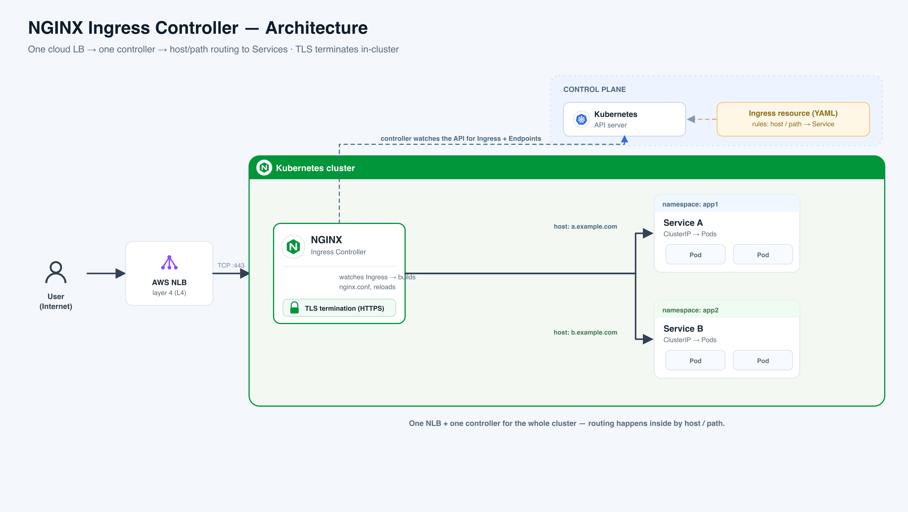

# NGINX Ingress Controller

**In one line:** an Ingress Controller is the **single front door + receptionist** for every app in your Kubernetes cluster — one entrance where all web traffic arrives, and a receptionist who reads the visitor's destination and walks them to the right office.

**The analogy that actually maps:** picture an office building. The **Ingress** is the *lobby directory on the wall* — a rule sheet that says "shop.example.com → 3rd floor, api.example.com → 5th floor." That sign does nothing by itself. The **Ingress Controller** is the *receptionist* who reads the sign and physically walks each visitor to the right office. One entrance, one receptionist, many offices — instead of cutting a separate street door for every department.

> ⚠️ **Say this first, it makes you stand out (2026):** the community `ingress-nginx` controller is **officially retired / archived as of March 2026** — no more releases, bug fixes, or security patches. The **Gateway API** is its official successor. Know it well, but know it's end-of-life.

**Read the diagram (left → right):**
- A **user on the internet** hits **one AWS NLB** — *(plain English: a cloud load balancer that just forwards raw TCP, "layer 4," no idea about URLs)* — on port 443.
- The NLB hands the connection to the **NGINX Ingress Controller pod**, which **terminates TLS** (decrypts HTTPS) and reads the request's hostname.
- The controller checks its rules: `a.example.com` → **Service A**, `b.example.com` → **Service B** — then forwards to that Service's **Pods**.
- **Top-right (control plane):** you write an **Ingress resource (YAML)** and post it to the **Kubernetes API server**; the controller *watches* the API and rebuilds its config whenever a rule or a pod changes.
- **The whole point:** one NLB + one controller for the entire cluster — all the routing happens *inside*, by host and path.

## Ingress vs Ingress Controller (the #1 thing interviewers test)
- **Ingress** — *(plain English: the directory sign / rule sheet)* — a Kubernetes object that maps **host + path → a Service**. It is pure config; on its own it does nothing.
- **Ingress Controller** — *(plain English: the receptionist who obeys the sign)* — a running pod (here, NGINX) that *watches* Ingress objects and turns them into live proxy config that actually routes traffic.
- **No controller = your Ingress does nothing.** The rule sheet needs someone to read it.
- **The classic gotcha:** the community one is `kubernetes/ingress-nginx` (annotation prefix `nginx.ingress.kubernetes.io/`) — *not* F5's commercial `nginx-ingress`. Different repo, different annotations.

## Host & path routing — how the receptionist decides
- **Host routing** — *(plain English: which building/company name is on the envelope)* — route by domain: `shop.example.com` vs `api.example.com`.
- **Path routing** — *(plain English: which floor/room number)* — route by URL path: `/cart` vs `/checkout` under the same host.
- **`pathType`** — *(plain English: how strict the address match is)* — `Prefix` (starts-with, most common) or `Exact` (full match). Wrong type → surprise 404s.
- One Ingress can fan a single domain out across many Services.

## Why one entry point beats one load balancer per app
- **Cost** — one cloud load balancer for the whole cluster instead of one (billed) LB per app. Giving every office its own street door is absurd and expensive.
- **One DNS / one IP** — many apps live behind a single address.
- **Centralized TLS + policy** — issue certs, force HTTPS, and apply rate limits *once* at the door, not per app.

## TLS termination in-cluster (cert-manager + Let's Encrypt)
- **TLS termination** — *(plain English: the receptionist opens the sealed HTTPS envelope at the door)* — NGINX decrypts HTTPS, then talks plain HTTP to backends inside the cluster.
- The cert lives in a **Secret** the Ingress references via `spec.tls`.
- **cert-manager** — *(plain English: a robot that requests and auto-renews certificates)* — a controller that talks to a certificate authority for you.
- **Let's Encrypt** — *(plain English: a free, automated certificate authority)* — cert-manager proves you own the domain (HTTP-01, or DNS-01 via Route 53 for wildcards) and drops the cert into the Secret. No human ever copies a `.pem` file.

## The annotations people actually configure (kept light)
An **annotation** — *(plain English: a sticky note on the rule sheet that tweaks NGINX's behavior)* — is how ingress-nginx exposes extra features.

| Annotation | Plain English | What it does |
|---|---|---|
| `rewrite-target` | "rename the path before handoff" | strips/rewrites the URL path — **needs `use-regex: true` + capture groups** or it mangles URLs (the #1 beginner bug) |
| `force-ssl-redirect` | "always send them to the HTTPS door" | forces HTTP → HTTPS (308), even behind a TLS-terminating LB |
| `limit-rps` | "cap requests per visitor per second" | per-client-IP rate limiting |
| `canary` + `canary-weight` | "let 10% try the new version" | splits traffic to a second Ingress by weight/header/cookie (often driven by Argo Rollouts) |
| `auth-url` | "check their badge at reception" | external auth check before letting traffic in (usually fronting oauth2-proxy for SSO) |

> Note: raw config `snippet` annotations are now **off by default** after the 2025 CVEs.

## The must-know 2025-2026 facts (state each plainly)
- **ingress-nginx is retired as of March 2026** — the repo is archived; no future fixes or CVE patches, so running it in prod now means unpatched-forever.
- **Gateway API is the official successor** — its typed **CRDs** — *(plain English: custom Kubernetes objects like Gateway and HTTPRoute)* — replace annotation sprawl; production-ready and recommended for anything greenfield.
- **~50% of clusters ran it** (per Datadog research) yet it was maintained by only one or two volunteers — that unsustainability is *why* it was retired.
- **IngressNightmare (CVE-2025-1974, CVSS 9.8, March 2025):** an unauthenticated attacker could reach the admission webhook, inject malicious NGINX config, and get **remote code execution → full cluster takeover** (read every Secret). Fixed in v1.11.5 / v1.12.1; the deeper fix was to lock down webhook network access.

## Where real companies use it
- **GitLab →** bundles ingress-nginx in its official Helm chart, so self-managed GitLab gets host/path routing + TLS out of the box.
- **Azure AKS →** Microsoft's managed "application routing" add-on is a hosted ingress-nginx, exposing customer apps with auto-issued certs.
- **GitLab Auto DevOps →** uses the `canary-weight` annotation to shift a slice of traffic to a new release before full rollout.
- **Datadog (research) →** its 2025 study measured ingress-nginx as the single most-deployed controller (~50% of clusters) — the data behind the migration wave.
- **Internal-tools teams →** put `auth-url` in front of Grafana/Kibana so every request forces Google/Okta login at the edge via oauth2-proxy.

## Interview Q&A

**Q: Ingress resource vs Ingress controller?**
- Resource = declarative rules (host, path, TLS) — just config.
- Controller = the running pod that reads them and programs a proxy.
- No controller → the Ingress does nothing; `ingressClassName` binds a rule to its controller.

**Q: Why an Ingress instead of a LoadBalancer Service per app?**
- One cloud LB for all apps vs one (paid) LB each — big cost win.
- One DNS/IP fronts many apps; TLS and rate limits are centralized.
- Consistent edge policy in one place.

**Q: How does host and path routing work?**
- By **host** — the domain on the request (shop vs api).
- By **path** — the URL segment, using `pathType: Prefix` or `Exact`.
- NGINX matches host first, then longest path, then forwards to that Service.

**Q: How does TLS termination work here?**
- NGINX decrypts HTTPS at the edge using a cert in a `tls` Secret.
- Backends see plain HTTP inside the cluster.
- **cert-manager + Let's Encrypt** auto-issue and auto-renew that cert — no manual cert handling.

**Q: What's the `rewrite-target` gotcha?**
- It rewrites the path before proxying (e.g. expose `/app` but the app expects `/`).
- It only behaves with **`use-regex: true` + capture groups** — `/app(/|$)(.*)` → `rewrite-target: /$2`.
- A plain `rewrite-target: /` silently mangles URLs.

**Q: Should you use ingress-nginx in 2026?**
- Not for greenfield — it's **retired/archived (March 2026)**, unpatched forever.
- Existing installs still run, but you're accepting security risk.
- Migrate to a **Gateway API** implementation; the `ingress2gateway` tool converts your rules + annotations.

**Q: Explain IngressNightmare.**
- Five CVEs; headline **CVE-2025-1974, CVSS 9.8** — unauthenticated **RCE**.
- The admission webhook was reachable from any pod and rendered attacker-supplied config.
- Result: full cluster takeover / all Secrets. Fix: upgrade + restrict webhook network access.

**Q: How does it update config without dropping connections?**
- Pod scale/rollout changes only the **backend list** — pushed into NGINX shared memory via its Lua module, **no reload**.
- Only host/path/TLS/annotation changes trigger a real `nginx -s reload`.
- That's why deploys don't drop live connections.

## Say it out loud
- "Ingress is just a rule sheet; the controller is the receptionist that enforces it."
- "One NLB + one controller fans out to every app by host and path — no LB per app."
- "TLS terminates in-cluster at NGINX; cert-manager + Let's Encrypt auto-issue and renew the cert."
- "`rewrite-target` only behaves with `use-regex` plus capture groups."
- "ingress-nginx is retired as of March 2026 — Gateway API is the successor."
- "IngressNightmare was an unauthenticated RCE (9.8) through the admission webhook."

## Sync to the demo — cicd_k8s **Setup 1**
- **Setup 1 = NGINX Ingress** behind an **AWS NLB**, serving `ingress.hobbyez.com`.
- **TLS terminates in-cluster at NGINX** via **cert-manager + Let's Encrypt** (DNS-01 / Route 53).
- **Teaching contrast:** Setups 2 & 3 terminate TLS **at the NLB via ACM** — same NLB pattern, different TLS boundary. *"Where the cert lives"* is the cleanest way to tell the three setups apart.

---

## Sources
- Retirement: https://kubernetes.io/blog/2025/11/11/ingress-nginx-retirement/ · https://kubernetes.io/blog/2026/01/29/ingress-nginx-statement/
- IngressNightmare: https://kubernetes.io/blog/2025/03/24/ingress-nginx-cve-2025-1974/ · https://www.wiz.io/blog/ingress-nginx-kubernetes-vulnerabilities
- Analogy + how it works: https://sealos.io/blog/what-is-a-kubernetes-ingress-controller · https://kubernetes.github.io/ingress-nginx/how-it-works/
- Company usage: https://docs.gitlab.com/charts/charts/nginx/
