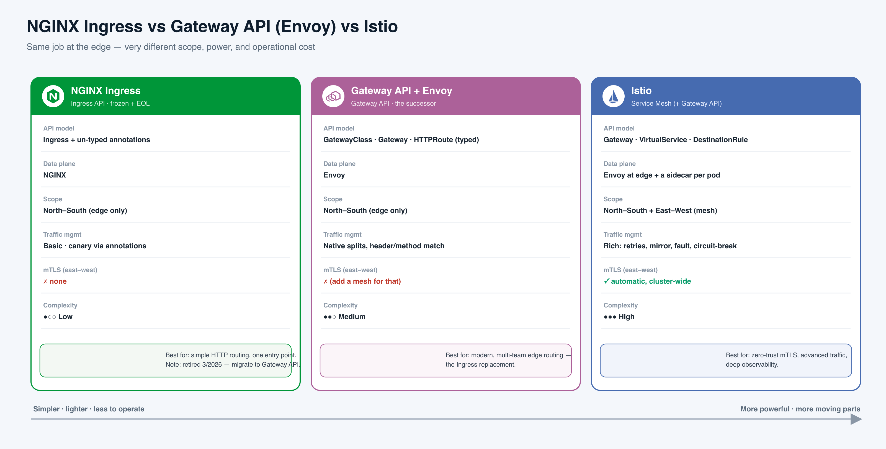

# NGINX Ingress vs Gateway API (Envoy) vs Istio

**In one line:** these are three ways to let outside traffic into a Kubernetes cluster — same job at the "front door," very different scope, power, and cost to run.

**The analogy — think of your cluster as an apartment building:**
- **NGINX Ingress = a plain front door with sticky-notes for rules.** One door does the job, but every special instruction ("send `/api` to that flat") is a Post-it stuck on it. Cheap and familiar — but the building is being condemned (retired March 2026).
- **Gateway API + Envoy = a modern front door with a proper intercom and a printed rulebook.** Same "let people in" job, but the rules are real labelled switches, and the building manager and each tenant get separate keys. This is the official replacement door.
- **Istio = that modern door PLUS a personal security guard walking beside every person inside the building.** The guard checks an ID badge at *every* internal door (not just the front one) and logs every step. Most secure, most staff to pay.

**Read the diagram (left → right):**
- Three tools doing the **same edge job**, laid out simplest (left) to most powerful (right).
- **NGINX Ingress (left):** one engine (NGINX), rules via annotations, guards the front door only, no internal encryption — marked retired 3/2026.
- **Gateway API + Envoy (middle):** typed objects (GatewayClass/Gateway/HTTPRoute), Envoy engine, native traffic splits — still front-door-only, so "add a mesh for internal mTLS." The successor.
- **Istio (right):** adds a helper next to *every* pod, so it covers the front door **and** all the internal hallways, with automatic encryption everywhere. Richest, but most moving parts.
- **Bottom arrow:** moving right buys power and pays for it in operational complexity.

---

## The 60-second answer

- **NGINX Ingress** — one flat **Ingress** object plus vendor **annotations** — *(plain English: extra rules typed as free-text labels on the object)*. Simplest to run; front-door (**Layer 7 / HTTP**) only. **Retired March 2026** — don't start new projects on it.
- **Gateway API + Envoy** — a set of typed **CRDs** — *(plain English: official Kubernetes object types, so features are real fields, not free-text)*: GatewayClass, Gateway, HTTPRoute. Vendor-neutral, does **L4 + L7** — *(plain English: raw TCP/UDP **and** HTTP)*. The official successor and default modern pick.
- **Istio** — a full **service mesh** — *(plain English: a network layer that also secures and watches traffic **between** your own pods, not just at the edge)*. Does the front door **and** automatic pod-to-pod encryption, advanced routing, and deep monitoring. Most powerful, most to operate.
- **Decision heuristic:** *"Do I need service-to-service security or observability? Yes → Istio. No → Gateway API."*

## One clean comparison

| | **NGINX Ingress** | **Gateway API + Envoy** | **Istio** |
|---|---|---|---|
| **API model** | Ingress + annotations (free-text) | GatewayClass / Gateway / HTTPRoute (typed) | Gateway / VirtualService / DestinationRule |
| **Layer / scope** | L7, front door only | L4 + L7, front door only | L4 + L7, front door **+ every internal hop** |
| **Traffic splitting** *(canary — send X% to a new version)* | Basic, via a canary annotation | Native **weight** field per backend | Weights + subsets — richest |
| **mTLS between pods** *(both sides prove identity with certs — the "ID badge check")* | None | None (add a mesh) | Automatic, cluster-wide |
| **Complexity** | Lowest — one deployment | Medium — control plane + Envoy | Highest — control plane + a helper per pod |
| **Status (2026)** | Retired March 2026 | Active — the recommended path | CNCF graduated, very active |

## When to pick which

- **Simple HTTP site, existing setup** → NGINX *was* the answer, but it's end-of-life. Use it only to keep something running while you migrate.
- **New build, want a standard + L4/L7 + real canary + clean team roles, but no mesh** → **Gateway API / Envoy Gateway.** The default modern choice.
- **Many microservices needing zero-trust encryption, deep per-service metrics, and advanced routing** → **Istio** (and prefer **Ambient mode** to keep the cost down).

## Where real companies land

- **~50% of all Kubernetes clusters ran NGINX Ingress** (Datadog research) → which is exactly why its retirement is a big deal; those teams are now migrating.
- **Bloomberg, SAP, Tencent Cloud, Docker → Envoy Gateway / Gateway API** in production as the forward path; Envoy itself was born at **Lyft** and is proven at Google scale.
- **Airbnb → Istio** across 20+ engineering teams and thousands of services for consistent security and safe progressive rollouts.
- **T-Mobile → 100+ Istio meshes**; **eBay → Istio** to spin up isolated production-like test environments ("Isolates").
- **Managed clouds (GKE, EKS)** ship Gateway API and Istio as first-class options, so you rarely install from scratch.

## Must-know 2025-2026 facts (one line each)

- **ingress-nginx is retired** — archived since 24 March 2026, no more bug fixes or CVE patches; running installs keep working but **unpatched**.
- **The last straw was security:** *IngressNightmare* (**CVE-2025-1974**) let attackers run code via those free-text annotation snippets.
- **Gateway API is the official successor** — GA v1.0 in Oct 2023, now **v1.5.1**, and the same YAML works across every vendor's controller.
- **`ingress2gateway` hit 1.0** (March 2026) — auto-converts 30+ NGINX annotations into Gateway/HTTPRoute objects.
- **Istio Ambient mode is GA** — replaces a helper-per-pod with one per **node**, cutting the mesh's footprint dramatically.

## Sync to the demo (Setups 1-3)

All three sit behind the **same AWS NLB** running the same app (React → Node → MongoDB). The cleanest way to tell them apart is **where the TLS certificate lives** — *(plain English: which box decrypts HTTPS)*.

- **Setup 1 — NGINX Ingress:** NLB just passes traffic through; TLS terminates **inside the cluster** at NGINX, using **cert-manager + Let's Encrypt** *(plain English: robot that auto-issues free certs)*.
- **Setup 2 — Envoy Gateway:** TLS terminates **at the NLB via ACM** *(AWS's cert service)*; Envoy sees plain HTTP.
- **Setup 3 — Istio:** TLS also terminates **at the NLB via ACM** — **plus** a mesh adds mTLS + telemetry between pods, deployed via **ArgoCD GitOps** *(plain English: Git is the source of truth; a bot syncs the cluster to match)*.

---

## Interview Q&A

**Q: What's the fundamental difference between the three? *(junior)***
- Ingress = one flat object + free-text annotations; needs a controller like NGINX.
- Gateway API = typed objects (GatewayClass/Gateway/Routes); the standardized successor.
- Istio = a full service mesh — the front door **plus** security between every pod.
- Soundbite: *"edge only vs modern portable edge vs edge + mesh."*

**Q: Why is ingress-nginx retired — what do we do? *(mid)***
- Archived March 2026: no fixes, no CVE patches, repo read-only.
- Cause: one or two spare-time maintainers plus security debt from free-text config snippets.
- **Migrate** to a Gateway API controller using `ingress2gateway`; old installs run on, but unpatched.

**Q: What does Gateway API actually fix over Ingress? *(mid)***
- Kills **annotation sprawl** — features become real typed fields.
- Adds **L4** (TCP/UDP) alongside L7, plus native traffic splitting and header/method matching.
- Adds **portability** and clean **role separation** — platform team owns the Gateway, app teams own their Routes.

**Q: Where does mTLS fit, and why can't NGINX or Envoy Gateway give it to you? *(senior)***
- mTLS between your own services is a **mesh** feature; NGINX and Envoy Gateway only secure the **front door**.
- Envoy Gateway can do edge TLS and upstream TLS, but **not** automatic pod-to-pod encryption.
- Istio auto-encrypts all pod-to-pod traffic → zero-trust. *"A gateway secures the front door; a mesh secures every hallway."*

**Q: How does traffic splitting / canary differ? *(mid)***
- NGINX: a bolt-on **canary annotation** — essentially two backends.
- Gateway API: a native **weight** field on each backend, in one rule.
- Istio: weights + version subsets, plus mirroring and fault injection — the richest.

**Q: Why does NGINX reload but Envoy/Istio don't — and why care? *(senior)***
- NGINX applies changes by **reloading the process**, which can drop live connections.
- Envoy is reconfigured live via **xDS** — *(plain English: a streaming config feed, no restart)* — so updates land in milliseconds.
- Matters for high-churn canary and route changes where you can't afford blips.

**Q: What is Istio Ambient and why does it matter here? *(senior)***
- Sidecar-less mode: one shared **ztunnel per node** for L4 + mTLS, plus optional per-namespace **waypoint** for L7.
- 10 ztunnels on 10 nodes instead of 100 sidecars for 100 pods — makes "just mTLS" cheap and narrows Istio's cost gap.
- **GA since Istio 1.24.**

**Q: In the demo all three sit behind an NLB — how does TLS differ? *(mid)***
- **Setup 1 (NGINX):** NLB passes through; cert lives **in-cluster** (cert-manager + Let's Encrypt).
- **Setup 2 (Envoy):** cert lives **at the NLB** (ACM); Envoy sees HTTP.
- **Setup 3 (Istio):** cert at the NLB too, **plus** internal mesh mTLS.
- *"Where the cert lives" is the cleanest way to tell the three apart.*

---

## Say it out loud

1. *"Ingress is a front door with sticky-note rules; Gateway API is a modern door with a real rulebook; Istio is that door plus a guard walking every hallway."*
2. *"2026 headline: ingress-nginx is retired — no more CVE patches — so the industry is moving to Gateway API."*
3. *"Gateway API is the successor to Ingress, not a competitor — GA since 2023, now v1.5."*
4. *"Ingress is L7-only; Gateway API and Istio both do L4 and L7."*
5. *"mTLS is the line in the sand: a gateway secures the front door; only a mesh secures every hallway."*
6. *"Order of operational cost: NGINX < Envoy Gateway < Istio — and Ambient shrinks Istio's end of it."*
