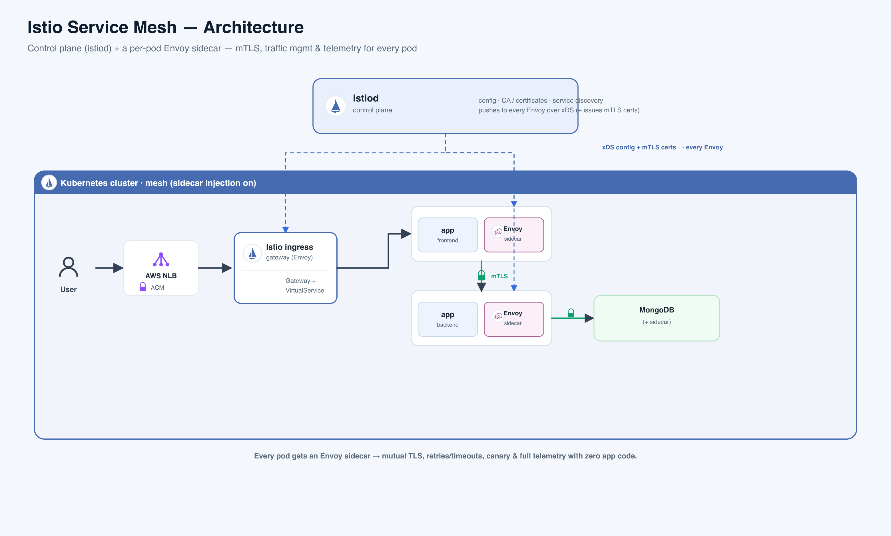

# Istio Service Mesh

**In one line:** Istio is a **service mesh** — an invisible networking layer that gives every service its own bodyguard, so security, routing, and monitoring live *next to* your app instead of *inside* it.

**The analogy — a big office where every employee gets a personal escort.** Picture a huge corporate building. Every employee (your app) gets a personal security escort who walks with them everywhere. The escort checks the other person's **ID badge** at every door (encryption + identity), knows the fastest route to any office (routing), retries if a door is stuck (retries/timeouts), and logs every trip (monitoring). The employees just do their jobs and talk normally — the escorts handle all the security and navigation. A central **security office** prints the badges and radios the latest rules to every escort. That's Istio: the escorts are the proxies, the security office is the brain, and your code never had to learn any of it.

**Read the diagram (left → right)**
- A **User** hits the **AWS NLB** (network load balancer), which holds the real TLS certificate (**ACM**) and forwards plain HTTP inward.
- The NLB hands off to the **Istio ingress gateway** — an Envoy proxy acting as the front door — which routes by hostname using **Gateway + VirtualService**.
- Traffic reaches the **frontend** and **backend** pods — but notice each pod has an **Envoy sidecar** glued to it. *All* traffic goes through the sidecar.
- Sidecar-to-sidecar hops are **mTLS** (the green locks): encrypted and identity-checked automatically — frontend → backend → MongoDB.
- Up top, **istiod** (dashed lines) pushes config + certificates down to every Envoy. It configures; the sidecars enforce.

---

## What is it, really? (plain-English glossary)

- **Service mesh** — *(plain English: a dedicated networking layer for service-to-service calls)* — handles encryption, routing, retries, and monitoring so your app code doesn't.
- **Sidecar** — *(plain English: a helper container that rides along in the same pod as your app)* — the classic Istio model puts an **Envoy** proxy — *(a fast, programmable network proxy)* — next to every app; traffic is silently redirected through it.
- **Data plane vs control plane** — *(plain English: the workers vs the manager)* — the **data plane** is the Envoy sidecars actually carrying traffic; the **control plane** is **istiod**, one program that tells them what to do. Rule of thumb: **istiod decides, Envoy enforces.**
- **East-west, not just north-south** — *(plain English: pod-to-pod traffic inside the cluster, not just traffic coming in the front door)* — a mesh's real value is securing and watching the *internal* calls between services. Using Istio only as an ingress misses the point.

## How it actually works

- **Sidecar injection** — *(plain English: Istio auto-adds the proxy for you)* — a Kubernetes **admission webhook** — *(a hook that rewrites a pod as it's created)* — inserts the Envoy sidecar, and iptables rules quietly reroute the pod's traffic through it. The app never notices.
- **xDS** — *(plain English: the live-update channel istiod uses to configure every proxy)* — istiod translates your rules + the cluster's services into Envoy config and streams it out. Change a rule, and every sidecar updates within seconds.
- **Automatic mTLS** — *(plain English: every service call is encrypted AND both sides prove who they are — like employees checking ID badges)* — istiod acts as the **CA** — *(certificate authority: the badge printer)* — and hands each workload a **SPIFFE** identity cert — *(a standard "who am I" ID)* — that auto-rotates. **PeerAuthentication** flips this from optional to **STRICT**.
- **The three routing objects** (Istio's **CRDs** — *(Custom Resource Definitions: extra Kubernetes object types Istio adds)*):
  - **Gateway** — *(the door)* — opens the edge: which ports, hostnames, and TLS.
  - **VirtualService** — *(the routing rules)* — **HOW** to route: match by host/path/header, weighted splits (canary), retries, timeouts.
  - **DestinationRule** — *(the per-destination policy)* — **WHAT** to do once a target is picked: load balancing, connection limits, circuit breaking.
- **Ambient mode** — *(plain English: the newer sidecar-less, cheaper option)* — instead of a proxy in every pod, one shared per-node proxy (**ztunnel**) does the encryption, and an optional **waypoint** proxy is added only where you need **L7** (HTTP-aware) features.

## Must-know current facts (2025-2026)

- **Ambient mode is GA** since **Istio 1.24 (Nov 2024)** — sidecar-less mesh is now production-ready, not experimental.
- Istio now **implements the Kubernetes Gateway API** (`GatewayClass: istio`) — the recommended path for new ingress, alongside the classic CRDs.
- Development is active: **1.27 (Aug 2025)** added alpha ambient multicluster; **1.29 (Feb 2026)** pushed it to beta.
- **A mesh is powerful but heavy** — the classic sidecar adds ~250 MB per pod and a few ms of latency, which is exactly why Ambient exists.

## Where real companies use it

- **Airbnb** → runs Istio as its microservices service mesh; chose it for extensibility and scale across many services.
- **T-Mobile** → uses Istio to get uniform observability/telemetry for every service *without* changing app code.
- **eBay** → uses Istio as its architectural pattern for east-west security (mTLS), service discovery, and observability.
- **Auto Trader UK** → stood up a full production service mesh in about a week.
- **Splunk** → runs progressive, canary-style control-plane upgrades to keep resource usage down.

## Sync to the demo — cicd_k8s **Setup 3**

- **Setup 3 = Istio** behind an **AWS NLB**, with TLS terminated at the NLB via **ACM**; the ingress gateway routes `istio.hobbyez.com` using **Gateway + VirtualService**, deployed by **ArgoCD** (GitOps).
- At the edge it looks just like Setups 1 & 2 — same NLB, same 3-tier app. The difference is *between the pods*: sidecar injection is on, so frontend → backend → MongoDB now gets **automatic mTLS + telemetry**.
- **The teaching point:** that east-west encryption + observability *is* the "mesh" part — something NGINX Ingress (Setup 1) or Envoy Gateway (Setup 2) alone can't give you.

---

## Interview Q&A

**Q: What is a service mesh and what problem does it solve?**
- An infra layer for service-to-service traffic: encryption, routing, retries, monitoring.
- It moves that logic into a proxy next to each service, out of your app code.
- Same security + observability in any language, with zero app changes.

**Q: Data plane vs control plane?**
- Data plane = the Envoy proxies carrying the traffic.
- Control plane = istiod, which configures them and issues their certs.
- Short version: istiod decides, Envoy enforces.

**Q: How does the sidecar get there?**
- An admission webhook rewrites the pod at creation to add the Envoy sidecar.
- iptables silently redirects the pod's traffic through it.
- The app is completely unaware.

**Q: How does automatic mTLS work?**
- istiod is the certificate authority; each service gets an auto-rotating identity cert.
- Sidecars encrypt and ID-check every call between them, like badge checks.
- PeerAuthentication set to STRICT makes it mandatory mesh-wide.

**Q: Gateway vs VirtualService vs DestinationRule?**
- Gateway = the door: ports, hosts, TLS at the edge.
- VirtualService = HOW to route: match, canary splits, retries, timeouts.
- DestinationRule = WHAT to do at the target: load balancing, circuit breaking.

**Q: North-south vs east-west — why does it matter?**
- North-south = traffic in/out the front door (ingress).
- East-west = pod-to-pod traffic inside the cluster.
- A mesh's real value is east-west; using it only as an ingress is overkill.

**Q: What is Ambient mode and why care?**
- Istio's sidecar-less mode, GA since 1.24.
- One shared per-node proxy (ztunnel) does L4 + mTLS; a waypoint adds L7 only where needed.
- Big win: much lower cost — no ~250 MB proxy in every pod.

**Q: When is a service mesh overkill?**
- A handful of services, one team, no strict compliance need.
- If you only need L4 (TCP-level) encryption, a CNI or Ambient L4-only is lighter.
- Adopt a full mesh once you have many services needing uniform mTLS, canary, and observability.

## Say it out loud

- "A service mesh gives every service a bodyguard, so security and routing live next to the app, not in it."
- "Data plane is Envoy, control plane is istiod — istiod decides, Envoy enforces."
- "mTLS is automatic — every call is encrypted and ID-checked, like badge checks between employees."
- "VirtualService is HOW to route; DestinationRule is WHAT to do once you've picked a target."
- "A mesh is about east-west, pod-to-pod — not just the front door."
- "Ambient mode swaps the per-pod sidecar for a shared node proxy — GA since 1.24, much cheaper."

---

## Sources
- Ambient GA: https://istio.io/latest/blog/2024/ambient-reaches-ga/ · Data-plane modes: https://istio.io/latest/docs/overview/dataplane-modes/
- Roadmap 2025-2026: https://istio.io/latest/blog/2025/roadmap/ · Case studies: https://istio.io/latest/about/case-studies/
